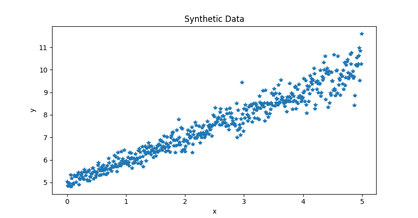

## Introduction
Gradient descent is a fundamental optimization algorithm widely used in machine learning and optimization problems. It is employed to minimize a function by iteratively moving in the direction of the steepest descent as indicated by the negative of the gradient. This article aims to explain the concepts behind gradient descent and its implementation in python.

Before diving into gradient descent, it's crucial to understand the notion of optimization. In optimization, the goal is to find the minimum or maximum of a function. For simplicity, let's focus on minimizing a function, typically denoted as $ f(x) $, where $ x $ represents the parameters of the function. The process of finding the minimum of $  f(x)  $ involves iterative steps towards adjusting the parameters $  x  $ until reaching a minimum.

## The Gradient

The gradient of a function, denoted as $ \nabla f(x) $, is a vector that points in the direction of the steepest increase of the function at a particular point. In other words, it indicates the direction in which the function grows fastest. The negative gradient, $ -\nabla f(x) $, points in the direction of the steepest decrease, which is the direction of the greatest decrease of the function.

## Gradient Descent Algorithm

Gradient descent operates by iteratively updating the parameters $ x $ in the opposite direction of the gradient of the function $ f(x) $ with respect to $ x $. The update rule for gradient descent can be represented as:

$$  x_{t+1} = x_t - \alpha \nabla f(x_t)  $$

where:
- $  x_t  $ represents the parameters at iteration $  t  $.
- $  \alpha $ (alpha) denotes the learning rate, which controls the step size or the rate at which the parameters are updated.

The learning rate is a critical hyperparameter in gradient descent. A too small learning rate may result in slow convergence, while a too large learning rate can cause divergence, where the optimization process fails to converge to a minimum.

## Implementation 

Initially a synthetic data is generated via the function randomDataGenerator. Using np.arange(), an array of x values ranging from 0 to 5 with a step size of 0.01 is created. Then, the slope and bias value are sampled from a normal distribution of mean 1 and 5 respectively. Later, y values for each x value using the equation of a straight line: $ y = \theta _{0} * x + \theta _{1} $.


```python 
def randomDataGenerator():
    """

    :param theta0: slope
    :param theta1: bias
    :return: data x,y
    """

    x = np.arange(start=0, stop=5, step=0.01)
    n_rnd = 500
    theta0 = np.random.normal(loc=1, scale=0.1, size=n_rnd)
    theta1 = np.random.normal(loc=5, scale=0.2, size=n_rnd)
    y = theta0_init * x + theta1_init
    return x , y, theta0_init, theta1_init

```

&nbsp;



## Linear Regression Cost Function

Once the data is generated, A cost function for linear regression is defined to apply gradient descent, often termed the Mean Squared Error (MSE), quantifies the model's performance by calculating the average of the squared differences between predicted and actual values across all training examples.

The formula for the MSE cost function is as follows:

> $$ J(\theta) = \frac{1}{m} \sum_{i=1}^{m} (h_{\theta}(x_{i}) - y_{i})^{2} $$

Here, 
- $ J(\theta) $ is the cost function.
- $ m $ is the number of training examples.
- $ h_{\theta}(x_{i}) $ represents the predicted value of the i-th example using parameters $  \theta $.
- $ y_{i} $ is the actual value of the i-th example.

 The parameters are the coefficients (slope and intercept) of the linear equation. To perform gradient descent, we need the partial derivatives of the cost function with respect to each parameter. These derivatives indicate the direction and magnitude of the parameter update that will decrease the cost [[1]](#1).

1. Partial derivative with respect to the intercept $ \theta_{0} $:

> $$ \frac {\partial }{\partial \theta _{0}}  J (\theta) = \frac {2}{m} \sum_{i=1}^{m} ( h_{\theta}(x_{i}) - y_{i} ) $$

2. Partial derivative with respect to the slope $ \theta_{1} $:
> $$ \frac {\partial }{\partial \theta _{1}}  J (\theta) = \frac {2}{m} \sum_{i=1}^{m} ( h_{\theta}(x_{i}) - y_{i} )  x_{i} $$

These equations show how much the cost function will change if we change each parameter slightly. The hypothesis used to create the synthetic data can be denoted as  $ H ( \theta)  $. To obtain the model parameters, we employ gradient descent by taking the derivative of the function with respect to the parameters. The following function implements the gradient descent algorithm. In each iteration, the parameters are updated by subtracting the derivative multiplied by the learning rate $ \alpha $. Convergence is determined by a threshold, which measures the change in parameter values between two consecutive iterations."


```python 
def hypothesis(x, theta0, theta1):
    return theta0*x + theta1

def gradientDescent(m,c,x,y):
    all_m = []
    all_c = []
    i = 1
    threshold = 999999
    while threshold > 10e-20:
        d_m = (np.sum((y - hypothesis(x,m,c)) * x)) * (-2/len(x))
        d_c = (np.sum( y - hypothesis(x,m,c)))      *  (-2/len(x))
        old_m = m
        all_m.append(m)
        all_c.append(c)
        m = m - 0.01 * d_m
        c = c - 0.01 * d_c
        threshold = abs(old_m - m)
        i = i +1
    return all_m, all_c
```


## Conclusion

Gradient descent is a powerful optimization algorithm used to minimize functions iteratively by moving in the direction of the steepest descent. Understanding gradient descent and its variants is essential for practitioners in machine learning and optimization fields, as it underpins many modern optimization techniques and algorithms. With proper tuning of hyperparameters and careful consideration of the problem domain, gradient descent can efficiently solve a wide range of optimization problems.


## Reference

<a id="1">[1]</a> : [Gradient Descent Derivation](https://mccormickml.com/2014/03/04/gradient-descent-derivation/)
