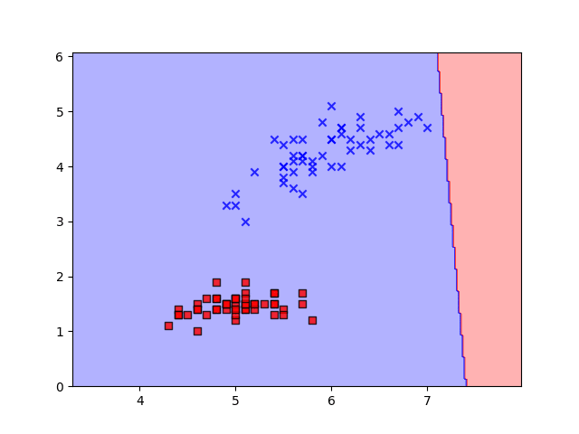

## Introduction

The single-layer perceptron is one of the simplest neural network architectures. It's a linear classifier used for binary classification tasks. In this article, we'll break down the single-layer perceptron algorithm and implement it in Python. The single-layer perceptron consists of only one layer of artificial neurons, which is also called the output layer. It takes a set of input features, applies weights to them, sums up the weighted inputs, and then applies an activation function to produce an output.

## Implementation 

Intially a python class that accomadate the fuctions to intialize the hyper parameter to run the preceptron like the learning rate, number of iterations and the plot object for visualization purpose. 

```python
class Perceptron(object):


    def __init__(self,learning_rate=0.01, n_iter=100, random_state=42):
        self.learning_rate = learning_rate
        self.n_iter = n_iter
        self.random_state = random_state
        self.fig, self.ax = plt.subplots()
        self.xdata, self.ydata = [], []
        self.ln, = plt.plot([], [], 'ro')


    def fit(self,X,y):
        self.db = DecisionBoundary(X,y)
        random_generator = np.random.RandomState(self.random_state)
        self.weights = random_generator.normal(loc=0.0, scale=0.01, size= X.shape[1])
        self.bias = random_generator.randint(1,1000)
        self.errors_ = []


        for i in range(self.n_iter):
            self.iteration = i

            errors = 0
            for xi, target in zip(X,y):
                error = target - self.predict(xi)
                if error != 0:
                    self.weights += self.learning_rate * error * xi
                    self.bias += self.learning_rate * error
                    errors += int(self.learning_rate * error != 0.0)

            self.db.plot_decision_boundary(self,self.iteration)
            self.errors_.append(errors)

        return self

    def activation_function(self,X):
        return np.dot(X,self.weights) + self.bias


    def predict(self, X):
        return np.where(self.activation_function(X) >= 0.0, 1, -1)
```

The ```fit(self,X,y)``` method takes two parameters ```X``` and ```y``` , where ```X``` is the input feature vector of the data and ```y``` is the target vector or the output vector respectively. ```activation_fuction(X)``` method underhood implements a linear model as defined below:

> $$   y = W \cdot x + b $$

In the above equation W and b are the weight and bias respectively, which are intialized randomly. A unit step is used as a activation function for the linear model. The activation fuction scales the output between -1 and 1. Gradient Descent method is used to find the optimal parameter of the model by iterating over the data.

To visualize the decision boundary a seperate class is created as shown below. ```plot_decesion_boundary()``` method takes the classifier parameter and predicts over arange of values in two dimensions, later a contour filled plot is applied to visualize the boundary predicted by the model. 


```python
class DecisionBoundary(object):


    def __init__(self,X,y,resolution=0.02):
        self.X = X
        self.y = y
        self.markers = ('s', 'x', 'o', '^', 'v')
        self.colors = ('red', 'blue', 'lightgreen', 'gray', 'cyan')
        self.cmap = ListedColormap(self.colors[:len(np.unique(y))])
        self.x1_min, self.x1_max = X[:, 0].min() -1 , X[:, 0].max() +1
        self.x2_min, self.x2_max = X[:, 1].min() -1 , X[:, 1].max() + 1

        self.xx1, self.xx2 = np.meshgrid(np.arange(self.x1_min, self.x1_max, resolution),
                               np.arange(self.x2_min, self.x2_max, resolution))


    def plot_decision_boundary(self,classifier,itr):
        Z = classifier.predict(np.array([self.xx1.ravel(), self.xx2.ravel()]).T)
        Z = Z.reshape(self.xx1.shape)

        fig = plt.figure()

        cont = plt.contourf(self.xx1, self.xx2, Z, alpha=0.3, cmap=self.cmap)
        plt.xlim(self.xx1.min(), self.xx1.max())
        plt.ylim(self.xx2.min(), self.xx2.max())

        for idx, cl in enumerate(np.unique(self.y)):
            plt.scatter(x=self.X[self.y == cl, 0],
                        y=self.X[self.y == cl, 1],
                        c=self.colors[idx],
                        alpha=0.8,
                        marker=self.markers[idx],
                        label=cl,
                        edgecolors='black')
        plt.savefig('img'+str(itr))
        plt.clf()
```



## Conclusion

The implementation showcased here provides a practical demonstration of how the perceptron learns to classify data by iteratively adjusting its weights and bias through the process of gradient descent. With each iteration, the perceptron edges closer to an optimal decision boundary that effectively separates the classes in the input data.

Moreover, the visualization of the decision boundary, achieved through the contour plot, offers invaluable insight into how the perceptron learns and adapts. This dynamic visualization not only aids in understanding the training process but also demonstrates the convergence of the perceptron as it refines its parameters.