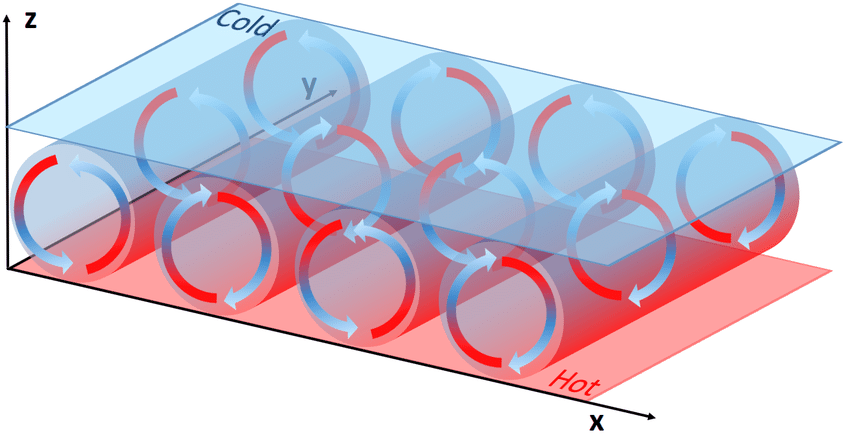

## Introduction 

[Lorenz system](https://mathworld.wolfram.com/LorenzAttractor.html) is one of the well studied non-linear model in [system dynamics](https://en.wikipedia.org/wiki/System_dynamics). Even though being well explored and simulated, it is a beautiful simplistic system that showcase **chaotic behaviour** for particular set of initial conditions. The non-linear differential equations were initially studied by N. Lorenz, a meteorologist during 1963. 

>  $$ \tag{1} \frac {dx}{dt} = \sigma (y - x) $$
>  $$ \tag{2} \frac {dy}{dt} = x(\rho -z ) - y $$ 
>  $$ \tag{3} \frac {dz}{dt} = xy - \beta z $$ 

The equation ```(1), (2) ``` and ```(3)``` are simplified form of heat convection in earth atmosphere which is governed by the famous [Navier-stokes equation](https://en.wikipedia.org/wiki/Navier%E2%80%93Stokes_equations). These equations could help to model and understand natural heat convection in fluid dynamics. Heat convection is the physical process where transfer of heat occurs due to movement of the fluid. Figure 1 shows a typical experimental setup for understanding heat convection. It consist of fluid between two parallel plates. When the bottom plate is exposed to hot temperature and top plate to ambient room temperature, this creates a linear heat gradient between the two plates. The hot fluid near the bottom plate is less dense, compared to cold fluid on top. This difference in the density, causes the cold fluid to move down towards the bottom due to gravity and the hot fluid to raise up. A continous cycle of the fluid movement is established, creating a cell like structure in between the parallel plates called convection cells as depicted in Figure 1. This pattern of convection cells are also called **Rayleigh-Bernad** convection cells, named after Lord Rayleigh, who sucessfully analyzed the structure in 1916.    
&nbsp;


## Simulation 

### Parameters 
These equations govern  the temporal evolution of three physical quantities, namely $ x $ corresponds to the rate of convection happening between the two plate. $y$ corresponds to the horizontal temperature variation and $ z $ corresponds to the vertical temperature variation. $ \sigma, \rho $ and $ \beta $ are constants of the system. The system is highly sensitive to initial conditions ($\sigma , \rho $ and $\beta$) that we choose. Starting the simulation with a different values of $ \sigma, \rho $ or $\beta $ that are infinitesimally different from each other could create a completely different output. In the following blog, the implementation and simulation of the equation in python is discussed along with visualization. Further, the behaviour of the system is analysed for different values of $ \sigma, \rho $ and $ \beta $ in the next blog post.  

### ODE Solver 
Python scipy library has a powerful ODE solver to simulate these equation. Even though the ODE solvers are quiet good, using a basic numerical itegration like **Runge-Kutta 4** method gives a better understading of simulation ODE's. 

```python 
import numpy as np
from scipy import integrate

x0 = [1, 1, 1]  # quantities vector [x,y,z]
sigma=10.0 
beta=8.0/3 
rho=28.0
t = np.linspace(0, 3, 1000)  # time vector 
```


The fourth order **Runge-Kutta** method also known as **RK4**, is an implicit-explicit iterative numerical integration method that includes the first order **Euler method** 


```python 
def rk4(func, tk, _yk, _dt=0.01, **kwargs):
    """
    single-step fourth-order numerical integration (RK4) method
    func: system of first order ODEs
    tk: current time step
    _yk: current state vector [y1, y2, y3, ...]
    _dt: discrete time step size
    **kwargs: additional parameters for ODE system
    returns: y evaluated at time k+1
    """

    # evaluate derivative at several stages within time interval
    f1 = func(tk, _yk, **kwargs)
    f2 = func(tk + _dt / 2, _yk + (f1 * (_dt / 2)), **kwargs)
    f3 = func(tk + _dt / 2, _yk + (f2 * (_dt / 2)), **kwargs)
    f4 = func(tk + _dt, _yk + (f3 * _dt), **kwargs)

    # return an average of the derivative over tk, tk + dt
    return _yk + (_dt / 6) * (f1 + (2 * f2) + (2 * f3) + f4)
```

#### Implementation


## Conclusion
add conlusion here 
## Reference